P8105 Final Project: Determinants of Global Violence
================
My An Huynh, Jeffrey Lin, Soo Min You, Hyun Kim, Malika Top

# Data: Source, Scraping Method & Cleaning

## Source

Since there are many determinants and indicators of violence, we chose
the indicators and outcomes that we thought were most interesting and
relevant in exploring violence from the following sources:

- International Monetary Fund (IMF)
  - Unemployment Rate
- United Nations Development Program (UNDP):
  - Human Development Index
- United Nations Office of Drugs and Crime (UNODC)
  - Corruption and Economic Crime
  - Criminal Justice Personnel
  - Drug Seizure (2018 - 2022)
  - Firearms Trafficking
  - Human Trafficking
  - Intentional Homicide
  - Violent and Sexual Crimes
- World Bank
  - Gross Domestic Product (GDP)
  - Inflation Rate (Measured by Consumer Price Index)
- World Health Organization (WHO)
  - Alcohol Consumption

Intentional homicide, and violent and sexual crimes were chosen as the
outcome variable to quantify violence.

## Scraping Method

The datasets were downloaded from the official websites of the sources
above. The names of the files were also changed accordingly for clarity
and to avoid confusion. For example, the alcohol consumption data file
was renamed from “data.csv” to “alcohol_consumption.csv”.

## Cleaning

### Economic Determinants

``` r
gdp_df = 
  read_excel(
    path = "data/worldbank/gdp.xls",
    sheet = "Data",
    skip = 3,
    na = ""
  ) |>
  select(country = "Country Code", "2015":"2023") |>
  pivot_longer(
    "2015":"2023",
    names_to = "year",
    values_to = "gdp"
  ) |>
  janitor::clean_names() |>
  mutate(year = as.numeric(year),
         country = countrycode(country, origin = "iso3c",
                               destination = "country.name",
                               nomatch = NA)) |>
  drop_na()
```

    ## Warning: There was 1 warning in `mutate()`.
    ## ℹ In argument: `country = countrycode(...)`.
    ## Caused by warning:
    ## ! Some values were not matched unambiguously: AFE, AFW, ARB, CEB, CHI, CSS, EAP, EAR, EAS, ECA, ECS, EMU, EUU, FCS, HIC, HPC, IBD, IBT, IDA, IDB, IDX, INX, LAC, LCN, LDC, LIC, LMC, LMY, LTE, MEA, MIC, MNA, NAC, OED, OSS, PRE, PSS, PST, SAS, SSA, SSF, SST, TEA, TEC, TLA, TMN, TSA, TSS, UMC, WLD, XKX

``` r
inflation_df = 
  read_excel(
    path = "data/worldbank/inflation_rate.xls",
    sheet = "Data",
    skip = 3,
    na = ""
  ) |>
  select(country = "Country Code", "2015":"2023") |>
  pivot_longer(
    "2015":"2023",
    names_to = "year",
    values_to = "inflation_rate"
  ) |>
  janitor::clean_names() |>
  mutate(year = as.numeric(year),
         country = countrycode(country, origin = "iso3c",
                               destination = "country.name",
                               nomatch = NA)) |>
  drop_na()
```

    ## Warning: There was 1 warning in `mutate()`.
    ## ℹ In argument: `country = countrycode(...)`.
    ## Caused by warning:
    ## ! Some values were not matched unambiguously: AFE, AFW, ARB, CEB, CHI, CSS, EAP, EAR, EAS, ECA, ECS, EMU, EUU, FCS, HIC, HPC, IBD, IBT, IDA, IDB, IDX, INX, LAC, LCN, LDC, LIC, LMC, LMY, LTE, MEA, MIC, MNA, NAC, OED, OSS, PRE, PSS, PST, SAS, SSA, SSF, SST, TEA, TEC, TLA, TMN, TSA, TSS, UMC, WLD, XKX

``` r
unemployment_df =
  read_excel(
    path = "data/imf/unemployment_rate.xls",
    range = "A1:AY116",
    na = "no data"
  ) |>
  select(country = "Unemployment rate (Percent)", "2015":"2023") |>
  drop_na(country) |>
  pivot_longer(
    "2015":"2023",
    names_to = "year",
    values_to = "unemployment_rate"
  ) |>
  janitor::clean_names() |>
  mutate(year = as.numeric(year),
         country = countrycode(country, origin = "country.name",
                               destination = "country.name",
                               nomatch = NA)) 

human_development_df =
  read_csv(
    file = "data/undp/human_development_index.csv",
    na = "") |>
  head(-11) |>
  pivot_longer(
    "hdi_2015":"hdi_2022",
    names_to = "year",
    values_to = "human_development_index"
  ) |>
  janitor::clean_names() |>
  select(country = "iso3", year, human_development_index) |>
  mutate(year = str_replace_all(year, "hdi_", ""),
         year = as.numeric(year),
         country = countrycode(country, origin = "iso3c",
                               destination = "country.name",
                               nomatch = NA))
```

    ## Rows: 206 Columns: 1076
    ## ── Column specification ────────────────────────────────────────────────────────
    ## Delimiter: ","
    ## chr    (4): iso3, country, hdicode, region
    ## dbl (1072): hdi_rank_2022, hdi_1990, hdi_1991, hdi_1992, hdi_1993, hdi_1994,...
    ## 
    ## ℹ Use `spec()` to retrieve the full column specification for this data.
    ## ℹ Specify the column types or set `show_col_types = FALSE` to quiet this message.

### Social Determinants

``` r
crime_rate_df = 
  read_excel(
    path = "data/unodc/corruption_economic_crime.xlsx",
    skip = 2
  ) |>
  janitor::clean_names() |>
  filter(unit_of_measurement == "Rate per 100,000 population") |>
  mutate(year = as.numeric(year),
         iso3_code = str_replace_all(iso3_code, "^GBR.*", "GBR"),
         iso3_code = str_replace_all(iso3_code, "^IRQ.*", "IRQ"),
         country = countrycode(iso3_code, origin = "iso3c",
                               destination = "country.name",
                               nomatch = NA)) |>
  group_by(country, region, year) |>
  summarize(avg_crime_rate = mean(value))
```

    ## Warning: There was 1 warning in `mutate()`.
    ## ℹ In argument: `country = countrycode(...)`.
    ## Caused by warning:
    ## ! Some values were not matched unambiguously: XKX

    ## `summarise()` has grouped output by 'country', 'region'. You can override using
    ## the `.groups` argument.

``` r
justice_personnel_df =
  read_excel(
    path = "data/unodc/criminal_justice_personnel.xlsx",
    skip = 2
  ) |>
  janitor::clean_names() |>
  filter(indicator == "Criminal Justice Personnel",
         unit_of_measurement == "Rate per 100,000 population",
         sex == "Total") |>
  mutate(year = as.numeric(year),
         iso3_code = str_replace_all(iso3_code, "^GBR.*", "GBR"),
         iso3_code = str_replace_all(iso3_code, "^IRQ.*", "IRQ"),
         country = countrycode(iso3_code, origin = "iso3c",
                               destination = "country.name",
                               nomatch = NA)) |>
  group_by(country, region, year) |>
  summarize(avg_personnel_rate = mean(value))
```

    ## Warning: There was 1 warning in `mutate()`.
    ## ℹ In argument: `country = countrycode(...)`.
    ## Caused by warning:
    ## ! Some values were not matched unambiguously: XKX

    ## `summarise()` has grouped output by 'country', 'region'. You can override using
    ## the `.groups` argument.

``` r
drugs_2018_2022_df =
  read_excel(
    path = "data/unodc/drug_seizures_2018_2022.xlsx",
    skip = 1
  ) |>
  janitor::clean_names() |>
  rename(year = reference_year) |>
  mutate(year = as.numeric(year),
         country = countrycode(ms_code, origin = "iso3c",
                               destination = "country.name",
                               nomatch = NA)) |>
  group_by(country, region, year) |>
  summarize(total_drug_seizures = sum(kilograms))
```

    ## `summarise()` has grouped output by 'country', 'region'. You can override using
    ## the `.groups` argument.

``` r
firearms_df = 
    read_excel(
    path = "data/unodc/firearms_trafficking.xlsx",
    skip = 2
  ) |>
  janitor::clean_names() |>
  mutate(year = as.numeric(year),
         iso3_code = str_replace_all(iso3_code, "^GBR.*", "GBR"),
         iso3_code = str_replace_all(iso3_code, "^IRQ.*", "IRQ"),
         country = countrycode(iso3_code, origin = "iso3c",
                               destination = "country.name",
                               nomatch = NA)) |>
  filter(indicator == "Arms seized",
         category == "Total") |>
  group_by(country, region, year) |>
  summarize(total_arms_seized = sum(value))
```

    ## `summarise()` has grouped output by 'country', 'region'. You can override using
    ## the `.groups` argument.

``` r
trafficking_df =
  read_excel(
    path = "data/unodc/human_trafficking.xlsx",
    skip = 2
  ) |>
  janitor::clean_names() |>
  filter(category == "Total",
         sex == "Total",
         age == "Total",
         txt_value != "<5") |>
  mutate(txt_value = str_replace_all(txt_value, ",", ""),
         txt_value = as.numeric(txt_value), 
         year = as.numeric(year), 
         country = countrycode(iso3_code, origin = "iso3c",
                               destination = "country.name",
                               nomatch = NA)) |>
  group_by(country, region, year) |>
  summarize(total_trafficking = sum(txt_value))
```

    ## Warning: There was 1 warning in `mutate()`.
    ## ℹ In argument: `country = countrycode(...)`.
    ## Caused by warning:
    ## ! Some values were not matched unambiguously: CAR, CAS, EEU, MCA, MCN, SAF, SAM

    ## `summarise()` has grouped output by 'country', 'region'. You can override using
    ## the `.groups` argument.

``` r
alcohol_consumption_df =
  read_csv(
    file = "data/who/alcohol_consumption.csv", 
    na = ""
  ) |>
  janitor::clean_names() |>
  filter(dim1 == "Both sexes") |>
  select(country = spatial_dim_value_code, year = period, 
         alcohol_consumption = fact_value_numeric) |>
  mutate(year = as.numeric(year),
         country = countrycode(country, origin = "iso3c",
                               destination = "country.name",
                               nomatch = NA))
```

    ## Rows: 11799 Columns: 34
    ## ── Column specification ────────────────────────────────────────────────────────
    ## Delimiter: ","
    ## chr  (15): IndicatorCode, Indicator, ValueType, ParentLocationCode, ParentLo...
    ## dbl   (4): Period, FactValueNumeric, FactValueNumericLow, FactValueNumericHigh
    ## lgl  (14): IsLatestYear, Dim2 type, Dim2, Dim2ValueCode, Dim3 type, Dim3, Di...
    ## dttm  (1): DateModified
    ## 
    ## ℹ Use `spec()` to retrieve the full column specification for this data.
    ## ℹ Specify the column types or set `show_col_types = FALSE` to quiet this message.

### Outcomes of Violence

``` r
homicide_rate_df = 
    readxl::read_excel(
    path = "data/unodc/intentional_homicide.xlsx",
    skip = 2
  ) |>
  janitor::clean_names() |>
  filter(indicator == "Victims of intentional homicide",
         unit_of_measurement == "Rate per 100,000 population",
         dimension == "Total",
         sex == "Total",
         age == "Total") |>
  mutate(year = as.numeric(year),
         iso3_code = str_replace_all(iso3_code, "^GBR.*", "GBR"),
         iso3_code = str_replace_all(iso3_code, "^IRQ.*", "IRQ"),
         country = countrycode(iso3_code, origin = "iso3c",
                               destination = "country.name",
                               nomatch = NA)) |>
  select(country, region, year, homicide_rate = value)
```

    ## Warning: There was 1 warning in `mutate()`.
    ## ℹ In argument: `country = countrycode(...)`.
    ## Caused by warning:
    ## ! Some values were not matched unambiguously: XKX

``` r
violence_rate_df = 
    readxl::read_excel(
    path = "data/unodc/violent_sexual_crime.xlsx",
    skip = 2
  ) |>
  janitor::clean_names() |>
  filter(indicator == "Violent offences",
         unit_of_measurement == "Rate per 100,000 population") |>
  pivot_wider(
    names_from = indicator,
    values_from = value
  ) |>
  rename(violence_rate = "Violent offences") |>
  mutate(year = as.numeric(year),
         iso3_code = str_replace_all(iso3_code, "^GBR.*", "GBR"),
         iso3_code = str_replace_all(iso3_code, "^IRQ.*", "IRQ"),
         country = countrycode(iso3_code, origin = "iso3c",
                               destination = "country.name",
                               nomatch = NA)) |>
  group_by(country, year) |>
  summarize(avg_violence_rate = mean(violence_rate)) 
```

    ## Warning: There was 1 warning in `mutate()`.
    ## ℹ In argument: `country = countrycode(...)`.
    ## Caused by warning:
    ## ! Some values were not matched unambiguously: XKX

    ## `summarise()` has grouped output by 'country'. You can override using the
    ## `.groups` argument.

For the economic determinants, all the datasets had years organized as
different columns, where each column represented values for that
specific year. Therefore, pivot_longer() was applied to pivot years and
their respective values into two columns.

For rates of all social determinants, we filtered and chose the data to
be rates per 100,000 people since it allows standardization for
comparability by adjusting for differences in population size.

The countrycode() function from the countrycode package was also
implemented in order to standardize the country names of each dataset
since some of the country names were represented inconsistently across
datasets. For example, South Korea was represented as “Korea (Republic
of)” and “Korea, Rep.”

### Merge Datasets

``` r
merged_violence_df =
  left_join(homicide_rate_df, violence_rate_df) |>
  left_join(gdp_df) |>
  left_join(inflation_df) |>
  left_join(unemployment_df) |>
  left_join(human_development_df) |>
  left_join(crime_rate_df) |>
  left_join(justice_personnel_df) |>
  left_join(drugs_2018_2022_df) |>
  left_join(firearms_df) |>
  left_join(trafficking_df) |>
  left_join(alcohol_consumption_df) |>
  mutate(country = as.factor(country),
         region = as.factor(region)) |>
  filter(between(year, 2015, 2023)) |>
  drop_na(country, region)
```

    ## Joining with `by = join_by(country, year)`
    ## Joining with `by = join_by(country, year)`
    ## Joining with `by = join_by(country, year)`
    ## Joining with `by = join_by(country, year)`
    ## Joining with `by = join_by(country, year)`
    ## Joining with `by = join_by(country, region, year)`
    ## Joining with `by = join_by(country, region, year)`
    ## Joining with `by = join_by(country, region, year)`
    ## Joining with `by = join_by(country, region, year)`
    ## Joining with `by = join_by(country, region, year)`
    ## Joining with `by = join_by(country, year)`

``` r
str(merged_violence_df)
```

    ## tibble [1,028 × 15] (S3: tbl_df/tbl/data.frame)
    ##  $ country                : Factor w/ 199 levels "Afghanistan",..: 1 6 2 5 188 9 10 4 12 13 ...
    ##  $ region                 : Factor w/ 5 levels "Africa","Americas",..: 3 1 4 4 3 2 3 5 5 4 ...
    ##  $ year                   : num [1:1028] 2015 2015 2015 2015 2015 ...
    ##  $ homicide_rate          : num [1:1028] 9.975 4.458 2.22 0 0.673 ...
    ##  $ avg_violence_rate      : num [1:1028] NA NA 5.51 41.26 2.16 ...
    ##  $ gdp                    : num [1:1028] 1.91e+10 9.05e+10 1.14e+10 2.79e+09 3.70e+11 ...
    ##  $ inflation_rate         : num [1:1028] -0.662 9.356 1.896 NA 4.07 ...
    ##  $ unemployment_rate      : num [1:1028] NA NA 17.1 3.9 NA 6.5 18.5 NA 6.1 6.2 ...
    ##  $ human_development_index: num [1:1028] 0.479 0.591 0.797 0.856 0.86 0.85 0.769 NA 0.933 0.91 ...
    ##  $ avg_crime_rate         : num [1:1028] NA NA 25.9 784.7 31.9 ...
    ##  $ avg_personnel_rate     : num [1:1028] NA NA 165 148 NA ...
    ##  $ total_drug_seizures    : num [1:1028] NA NA NA NA NA NA NA NA NA NA ...
    ##  $ total_arms_seized      : num [1:1028] NA NA NA NA NA NA NA NA NA NA ...
    ##  $ total_trafficking      : num [1:1028] NA NA 109 NA 34 ...
    ##  $ alcohol_consumption    : num [1:1028] 0.009 7.76 5.04 10.76 2.37 ...

The final merged dataset includes 1028 rows and 15 columns, including
country, region, year, homicide rate, average violence offence rate,
gdp, inflation rate, unemployment rate, average crime rate, average
(criminal justice) personnel rate, total drug seized (2018 - 2022),
total arm seized, total trafficking and alcohol consumption as
variables. There is a total of 163 distinct countries.

After merging the datasets, country and region were converted to
categorical variables. Rows with NA values for country and region were
dropped, and the dataset was filtered for the years between 2015 and
2023.

# EDA

## Visualization

``` r
homicide_visual_df = 
    readxl::read_excel(
    path = "data/unodc/intentional_homicide.xlsx",
    skip = 2
  ) |>
  janitor::clean_names() |>
  filter(indicator == "Victims of intentional homicide",
         unit_of_measurement == "Rate per 100,000 population",
         category != "Total",
         sex != "Total",
         between(year, 2015, 2023)) |>
  select(country, region, category, sex, year, homicide_rate = value)
```

``` r
homicide_visual_df |>
  group_by(region, year) |>
  summarize(avg_homicide_rate = mean(homicide_rate)) |>
  ggplot(aes(y = avg_homicide_rate, x = as.factor(year), fill = region)) +
  geom_col(position = "dodge", bin = 3.0) + 
  labs(x = "Year",
       y = "Average Homicide Rate",
       Title = "Average Homicide Rate Across Region")
```

    ## `summarise()` has grouped output by 'region'. You can override using the
    ## `.groups` argument.

    ## Warning in geom_col(position = "dodge", bin = 3): Ignoring unknown parameters:
    ## `bin`

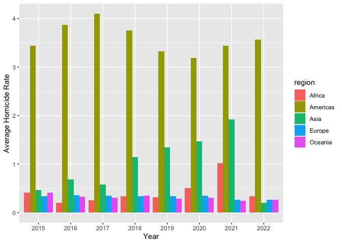<!-- -->

``` r
homicide_visual_df |>
  group_by(region, sex, year) |>
  summarize(avg_homicide_rate = mean(homicide_rate)) |>
  ggplot(aes(y = avg_homicide_rate, x = year, color = sex)) +
  geom_smooth(se = FALSE) +
  facet_grid(~region) + 
  labs(x = "Year",
       y = "Average Homicide Rate",
       Title = "Average Homicide Rate Trend")
```

    ## `summarise()` has grouped output by 'region', 'sex'. You can override using the
    ## `.groups` argument.
    ## `geom_smooth()` using method = 'loess' and formula = 'y ~ x'

<!-- -->

## Data Transformation

## Regression

Split data into training and testing + visualize distributions

``` r
train_df = sample_frac(merged_violence_df, size = 0.8)
test_df = anti_join(merged_violence_df, train_df, by = "gdp")

plot_distributions = function(column, name) {
  
  if(is.numeric(column) & name != "year") {
    ggplot(train_df, aes(x = column)) +
    geom_density() +
    labs(title = paste("Distribution of", name))
  }
  
}

train_list = colnames(train_df)
map(train_list, \(x) plot_distributions(pull(train_df, x), x))
```

    ## [[1]]
    ## NULL
    ## 
    ## [[2]]
    ## NULL
    ## 
    ## [[3]]
    ## NULL
    ## 
    ## [[4]]

<!-- -->

    ## 
    ## [[5]]

    ## Warning: Removed 208 rows containing non-finite outside the scale range
    ## (`stat_density()`).

<!-- -->

    ## 
    ## [[6]]

    ## Warning: Removed 17 rows containing non-finite outside the scale range
    ## (`stat_density()`).

<!-- -->

    ## 
    ## [[7]]

    ## Warning: Removed 80 rows containing non-finite outside the scale range
    ## (`stat_density()`).

<!-- -->

    ## 
    ## [[8]]

    ## Warning: Removed 237 rows containing non-finite outside the scale range
    ## (`stat_density()`).

<!-- -->

    ## 
    ## [[9]]

    ## Warning: Removed 53 rows containing non-finite outside the scale range
    ## (`stat_density()`).

<!-- -->

    ## 
    ## [[10]]

    ## Warning: Removed 221 rows containing non-finite outside the scale range
    ## (`stat_density()`).

<!-- -->

    ## 
    ## [[11]]

    ## Warning: Removed 382 rows containing non-finite outside the scale range
    ## (`stat_density()`).

<!-- -->

    ## 
    ## [[12]]

    ## Warning: Removed 477 rows containing non-finite outside the scale range
    ## (`stat_density()`).

<!-- -->

    ## 
    ## [[13]]

    ## Warning: Removed 572 rows containing non-finite outside the scale range
    ## (`stat_density()`).

<!-- -->

    ## 
    ## [[14]]

    ## Warning: Removed 346 rows containing non-finite outside the scale range
    ## (`stat_density()`).

<!-- -->

    ## 
    ## [[15]]

    ## Warning: Removed 242 rows containing non-finite outside the scale range
    ## (`stat_density()`).

<!-- -->

After looking at the distributions of all variables, all variables are
skewed right, except for human development index which is bimodal and
slightly left-skewed. I will apply ln transformations and box-cox
transformations to these variables, and use the Shapiro-Wilk test to
test for normality. Even though it is not necessary to normalize the
predictors, this step will stablize variance and reduce
heteroscedasticity. I think it will be helpful for further steps with
model.

Transformation step involves writing a function for ln transformation
and a function for box_cox transformation. The functions will be mapped
into the nested listcol which includes all continuous variables in the
train_df dataset.

``` r
ln_transform = function(value) {
  return(log(abs(value)))
}

ln_train_df = 
  train_df |>
  mutate(across(c(homicide_rate:alcohol_consumption), 
                ln_transform))

map(train_list, \(x) plot_distributions(pull(ln_train_df, x), x))
```

    ## [[1]]
    ## NULL
    ## 
    ## [[2]]
    ## NULL
    ## 
    ## [[3]]
    ## NULL
    ## 
    ## [[4]]

    ## Warning: Removed 14 rows containing non-finite outside the scale range
    ## (`stat_density()`).

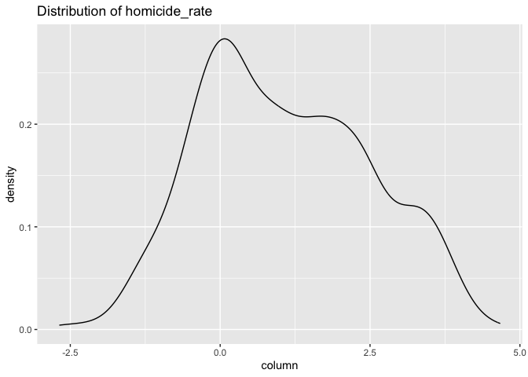<!-- -->

    ## 
    ## [[5]]

    ## Warning: Removed 210 rows containing non-finite outside the scale range
    ## (`stat_density()`).

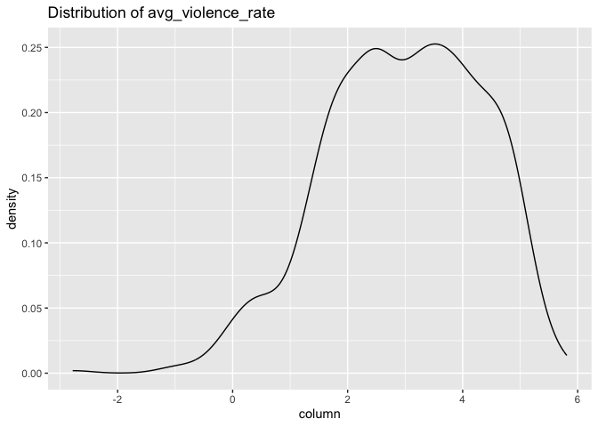<!-- -->

    ## 
    ## [[6]]

    ## Warning: Removed 17 rows containing non-finite outside the scale range
    ## (`stat_density()`).

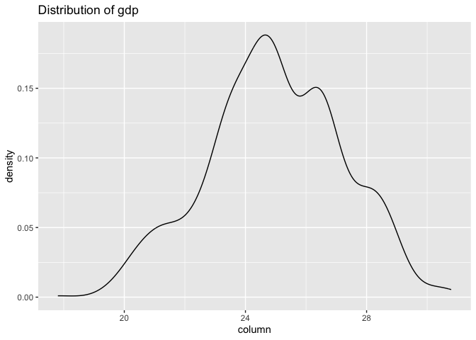<!-- -->

    ## 
    ## [[7]]

    ## Warning: Removed 80 rows containing non-finite outside the scale range
    ## (`stat_density()`).

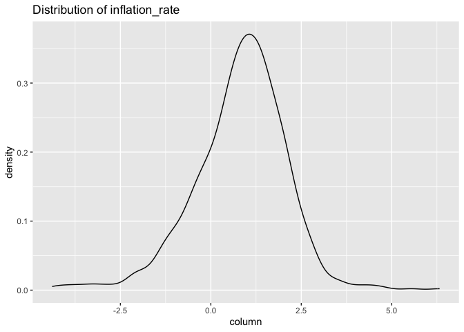<!-- -->

    ## 
    ## [[8]]

    ## Warning: Removed 237 rows containing non-finite outside the scale range
    ## (`stat_density()`).

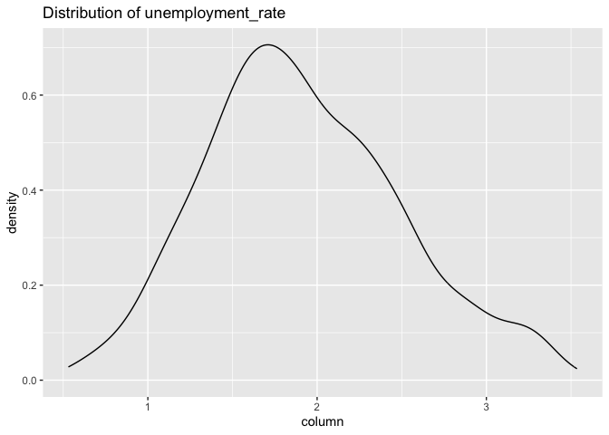<!-- -->

    ## 
    ## [[9]]

    ## Warning: Removed 53 rows containing non-finite outside the scale range
    ## (`stat_density()`).

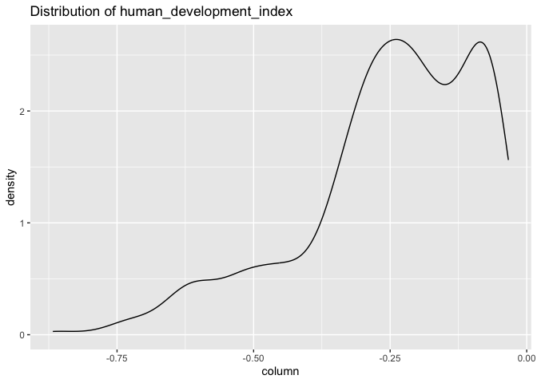<!-- -->

    ## 
    ## [[10]]

    ## Warning: Removed 226 rows containing non-finite outside the scale range
    ## (`stat_density()`).

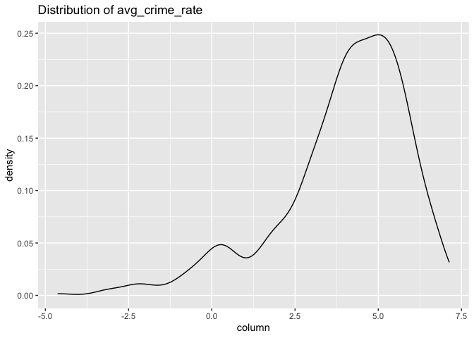<!-- -->

    ## 
    ## [[11]]

    ## Warning: Removed 382 rows containing non-finite outside the scale range
    ## (`stat_density()`).

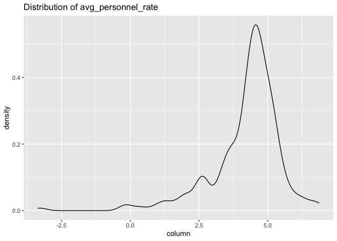<!-- -->

    ## 
    ## [[12]]

    ## Warning: Removed 478 rows containing non-finite outside the scale range
    ## (`stat_density()`).

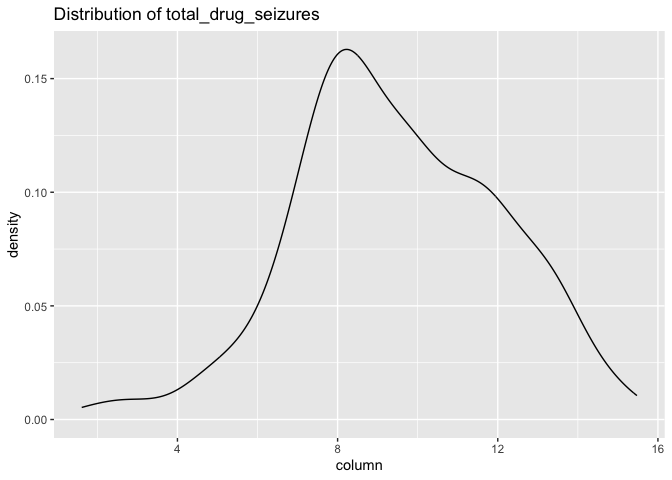<!-- -->

    ## 
    ## [[13]]

    ## Warning: Removed 574 rows containing non-finite outside the scale range
    ## (`stat_density()`).

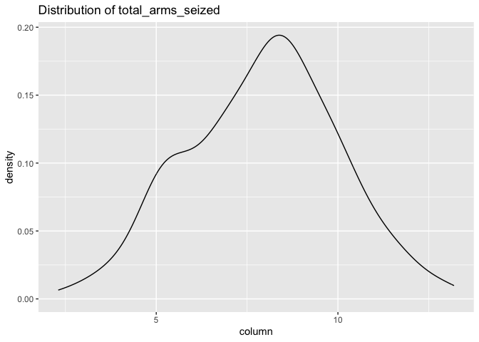<!-- -->

    ## 
    ## [[14]]

    ## Warning: Removed 346 rows containing non-finite outside the scale range
    ## (`stat_density()`).

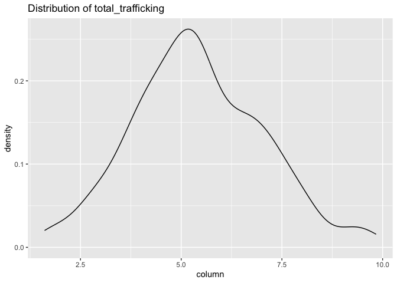<!-- -->

    ## 
    ## [[15]]

    ## Warning: Removed 248 rows containing non-finite outside the scale range
    ## (`stat_density()`).

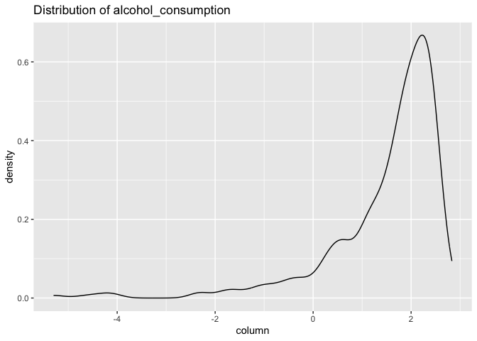<!-- -->

``` r
library(MASS)
```

    ## 
    ## Attaching package: 'MASS'

    ## The following object is masked from 'package:dplyr':
    ## 
    ##     select

``` r
boxcox_transform = function(value) {
  value = value + abs(min(value, na.rm = TRUE)) + 0.00001
  
  boxcox_result = boxcox(value ~ 1, plotit = FALSE)
  lambda = boxcox_result$x[which.max(boxcox_result$y)]
  if(lambda == 0) {
    return(log(value))
  }
  return((value^lambda - 1) / lambda)
}

boxcox_train_df = 
  train_df |>
  mutate(across(c(homicide_rate:alcohol_consumption), 
                boxcox_transform))

map(train_list, \(x) plot_distributions(pull(boxcox_train_df, x), x))
```

    ## [[1]]
    ## NULL
    ## 
    ## [[2]]
    ## NULL
    ## 
    ## [[3]]
    ## NULL
    ## 
    ## [[4]]

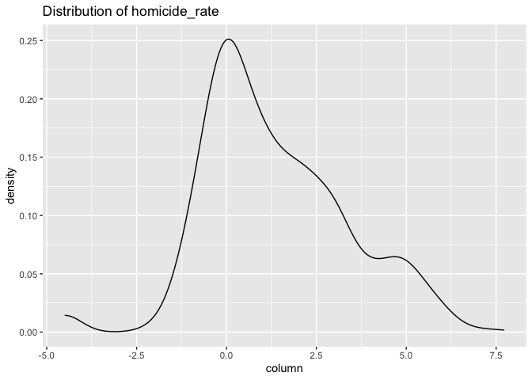<!-- -->

    ## 
    ## [[5]]

    ## Warning: Removed 208 rows containing non-finite outside the scale range
    ## (`stat_density()`).

<!-- -->

    ## 
    ## [[6]]

    ## Warning: Removed 17 rows containing non-finite outside the scale range
    ## (`stat_density()`).

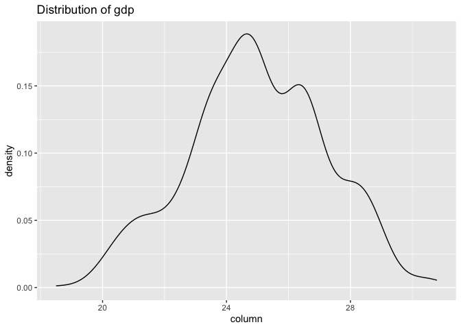<!-- -->

    ## 
    ## [[7]]

    ## Warning: Removed 80 rows containing non-finite outside the scale range
    ## (`stat_density()`).

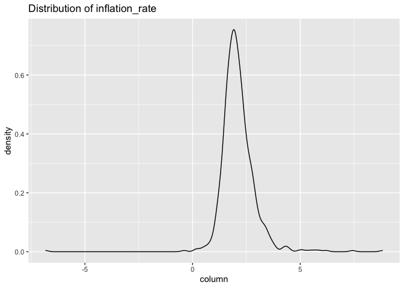<!-- -->

    ## 
    ## [[8]]

    ## Warning: Removed 237 rows containing non-finite outside the scale range
    ## (`stat_density()`).

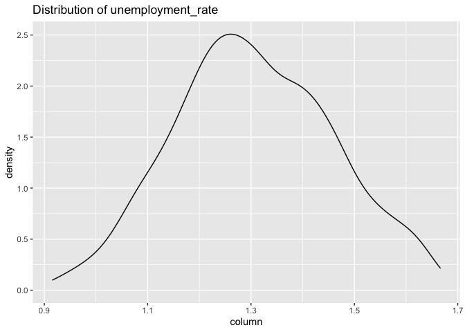<!-- -->

    ## 
    ## [[9]]

    ## Warning: Removed 53 rows containing non-finite outside the scale range
    ## (`stat_density()`).

<!-- -->

    ## 
    ## [[10]]

    ## Warning: Removed 221 rows containing non-finite outside the scale range
    ## (`stat_density()`).

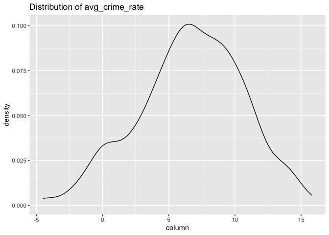<!-- -->

    ## 
    ## [[11]]

    ## Warning: Removed 382 rows containing non-finite outside the scale range
    ## (`stat_density()`).

<!-- -->

    ## 
    ## [[12]]

    ## Warning: Removed 477 rows containing non-finite outside the scale range
    ## (`stat_density()`).

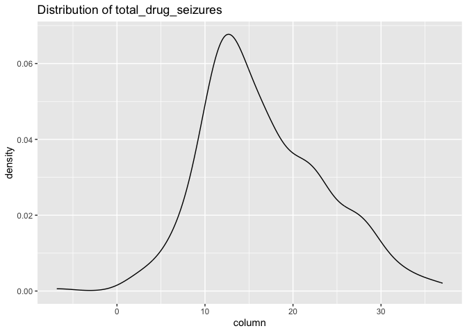<!-- -->

    ## 
    ## [[13]]

    ## Warning: Removed 572 rows containing non-finite outside the scale range
    ## (`stat_density()`).

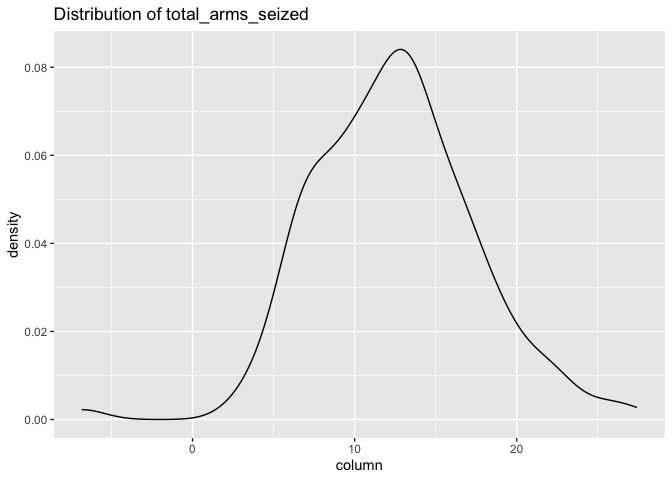<!-- -->

    ## 
    ## [[14]]

    ## Warning: Removed 346 rows containing non-finite outside the scale range
    ## (`stat_density()`).

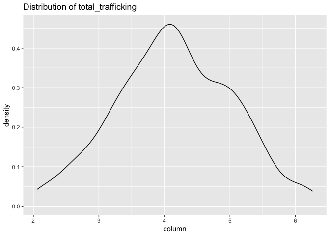<!-- -->

    ## 
    ## [[15]]

    ## Warning: Removed 242 rows containing non-finite outside the scale range
    ## (`stat_density()`).

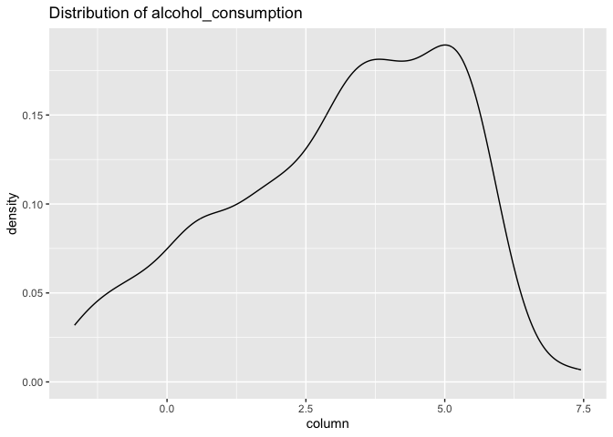<!-- -->
