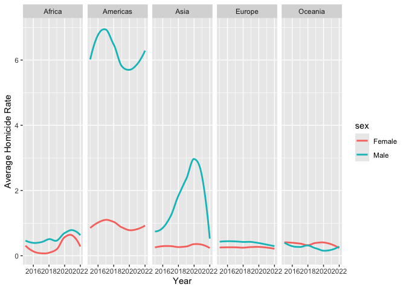

P8105 Final Project: Determinants of Global Violence
================
My An Huynh, Jeffrey Lin, Soo Min You, Hyun Kim, Malika Top

## Motivation

## Initial Questions

# Data: Source, Scraping Method & Cleaning

## Source

Since there are many determinants and indicators of violence, we chose
the indicators and outcomes that we thought were most interesting and
relevant in exploring violence from the following sources:

- International Monetary Fund (IMF)
  - Unemployment Rate
- United Nations Development Program (UNDP):
  - Human Development Index
- United Nations Office of Drugs and Crime (UNODC)
  - Corruption and Economic Crime
  - Criminal Justice Personnel
  - Human Trafficking
  - Intentional Homicide
  - Violent and Sexual Crimes
- World Bank
  - Gross Domestic Product (GDP)
  - Inflation Rate (Measured by Consumer Price Index)
- World Health Organization (WHO)
  - Alcohol Consumption

Intentional homicide, and violent and sexual crimes were chosen as the
outcome variable to quantify violence.

- Intentional homicide:
  - counting unit: individual victim of homicide
  - classification:
    - situational context: organized crime, interpersonal (excluding
      familial/intimate), socio-political
    - relationship to perpetrator: intimate partner, family member,
      friend, colleague, etc.
    - mechanism: firearm, weapon, physical force
- Violent and sexual crimes:
  - counting unit: number of individual offences per 100,000 population
  - classification of offenses:
    - rape
    - serious assault
    - kidnapping
    - sexual violence
  - NOTE: some countries used other counting unit (a series of offenses
    to form a case, or multiple cases to form an investigation)

## Scraping Method

The datasets were downloaded from the official websites of the sources
above. The names of the files were also changed accordingly for clarity
and to avoid confusion. For example, the alcohol consumption data file
was renamed from “data.csv” to “alcohol_consumption.csv”.

## Cleaning

### Economic Determinants

``` r
gdp_df = 
  read_excel(
    path = "data/worldbank/gdp.xls",
    sheet = "Data",
    skip = 3,
    na = ""
  ) |>
  select(iso3_code = 2, "2015":"2023")

inflation_df = 
  read_excel(
    path = "data/worldbank/inflation_rate.xls",
    sheet = "Data",
    skip = 3,
    na = ""
  ) |>
  select(iso3_code = 2, "2015":"2023") 

unemployment_df =
  read_excel(
    path = "data/imf/unemployment_rate.xls",
    range = "A1:AY116",
    na = "no data"
  ) |>
  select(iso3_code = 1, "2015":"2023") 

human_develop_df =
  read_csv(
    file = "data/undp/human_development_index.csv",
    na = "") |>
  head(-11) |>
  rename_with(gsub, pattern = "^hdi_", replacement = "") |>
  select(iso3_code = 1, "2015":"2022")
```

    ## Rows: 206 Columns: 1076
    ## ── Column specification ────────────────────────────────────────────────────────
    ## Delimiter: ","
    ## chr    (4): iso3, country, hdicode, region
    ## dbl (1072): hdi_rank_2022, hdi_1990, hdi_1991, hdi_1992, hdi_1993, hdi_1994,...
    ## 
    ## ℹ Use `spec()` to retrieve the full column specification for this data.
    ## ℹ Specify the column types or set `show_col_types = FALSE` to quiet this message.

### Social Determinants

``` r
econ_crime_df = 
  read_excel(
    path = "data/unodc/corruption_economic_crime.xlsx",
    skip = 2
  ) |>
  janitor::clean_names() |>
  filter(unit_of_measurement == "Rate per 100,000 population") 

personnel_df =
  read_excel(
    path = "data/unodc/criminal_justice_personnel.xlsx",
    skip = 2
  ) |>
  janitor::clean_names() |>
  filter(indicator == "Criminal Justice Personnel",
         sex == "Total",
         unit_of_measurement == "Rate per 100,000 population")

trafficking_df =
  read_excel(
    path = "data/unodc/human_trafficking.xlsx",
    skip = 2
  ) |>
  janitor::clean_names() |>
  filter(category == "Total",
         sex == "Total",
         age == "Total",
         txt_value != "<5") |>
  mutate(value = str_replace_all(txt_value, ",", ""),
         value = as.numeric(value))

alcohol_df =
  read_csv(
    file = "data/who/alcohol_consumption.csv", 
    na = ""
  ) |>
  janitor::clean_names() |>
  filter(dim1 == "Both sexes") |>
  select(iso3_code = spatial_dim_value_code, 
         year = period, value = fact_value_numeric)
```

    ## Rows: 11799 Columns: 34
    ## ── Column specification ────────────────────────────────────────────────────────
    ## Delimiter: ","
    ## chr  (15): IndicatorCode, Indicator, ValueType, ParentLocationCode, ParentLo...
    ## dbl   (4): Period, FactValueNumeric, FactValueNumericLow, FactValueNumericHigh
    ## lgl  (14): IsLatestYear, Dim2 type, Dim2, Dim2ValueCode, Dim3 type, Dim3, Di...
    ## dttm  (1): DateModified
    ## 
    ## ℹ Use `spec()` to retrieve the full column specification for this data.
    ## ℹ Specify the column types or set `show_col_types = FALSE` to quiet this message.

### Outcomes of Violence

``` r
homicide_df = 
    readxl::read_excel(
    path = "data/unodc/intentional_homicide.xlsx",
    skip = 2
  ) |>
  janitor::clean_names() |>
  filter(indicator == "Victims of intentional homicide",
         unit_of_measurement == "Rate per 100,000 population",
         dimension == "Total",
         sex == "Total",
         age == "Total")

violence_df = 
    readxl::read_excel(
    path = "data/unodc/violent_sexual_crime.xlsx",
    skip = 2
  ) |>
  janitor::clean_names() |>
  filter(indicator == "Violent offences",
         unit_of_measurement == "Rate per 100,000 population")
```

For the economic determinants, all the datasets had years organized as
different columns, where each column represented values for that
specific year. Therefore, pivot_longer() was applied to pivot years and
their respective values into two columns.

For rates of all social determinants, we filtered and chose the data to
be rates per 100,000 people since it allows standardization for
comparability by adjusting for differences in population size.

The countrycode() function from the countrycode package was also
implemented in order to standardize the country names of each dataset
since some of the country names were represented inconsistently across
datasets. For example, South Korea was represented as “Korea (Republic
of)” and “Korea, Rep.”

### Function to pivot data, average rates across category and clean country names

``` r
tidy_df = function(data, name, format = "iso3c", pivot = FALSE, average = FALSE) {
  
  if(pivot) {
    data = 
      data |>
      pivot_longer(
        cols = -iso3_code,
        names_to = "year",
        values_to = name
      ) |>
      janitor::clean_names()
  }
  
  data = 
    data |>
    mutate(year = as.numeric(year),
           iso3_code = str_replace_all(iso3_code, "^GBR.*", "GBR"),
           iso3_code = str_replace_all(iso3_code, "^IRQ.*", "IRQ"),
           country = countrycode(iso3_code, origin = format,
                                 destination = "country.name",
                                 nomatch = NA)) |> drop_na()
  
  if(average) {
    if("region" %in% colnames(data)) {
      data = 
        data |>
        group_by(country, region, year) |>
        summarize(!!name := mean(value))
    }
    
    else {
        data = 
          data |>
          group_by(country, year) |>
          summarize(!!name := mean(value))
    }
    
  }
  
  return(data)
}
```

### Tidy

``` r
gdp_df = tidy_df(gdp_df, "gdp", pivot = TRUE)
```

    ## Warning: There was 1 warning in `mutate()`.
    ## ℹ In argument: `country = countrycode(...)`.
    ## Caused by warning:
    ## ! Some values were not matched unambiguously: AFE, AFW, ARB, CEB, CHI, CSS, EAP, EAR, EAS, ECA, ECS, EMU, EUU, FCS, HIC, HPC, IBD, IBT, IDA, IDB, IDX, INX, LAC, LCN, LDC, LIC, LMC, LMY, LTE, MEA, MIC, MNA, NAC, OED, OSS, PRE, PSS, PST, SAS, SSA, SSF, SST, TEA, TEC, TLA, TMN, TSA, TSS, UMC, WLD, XKX

``` r
inflation_df = tidy_df(inflation_df, "inflation_rate", pivot = TRUE)
```

    ## Warning: There was 1 warning in `mutate()`.
    ## ℹ In argument: `country = countrycode(...)`.
    ## Caused by warning:
    ## ! Some values were not matched unambiguously: AFE, AFW, ARB, CEB, CHI, CSS, EAP, EAR, EAS, ECA, ECS, EMU, EUU, FCS, HIC, HPC, IBD, IBT, IDA, IDB, IDX, INX, LAC, LCN, LDC, LIC, LMC, LMY, LTE, MEA, MIC, MNA, NAC, OED, OSS, PRE, PSS, PST, SAS, SSA, SSF, SST, TEA, TEC, TLA, TMN, TSA, TSS, UMC, WLD, XKX

``` r
human_develop_df = tidy_df(human_develop_df, "hdi", pivot = TRUE)
unemployment_df = tidy_df(unemployment_df, "unemployment_rate", 
                           format = "country.name", pivot = TRUE)

econ_crime_df = tidy_df(econ_crime_df, "crime_rate",  average = TRUE)
```

    ## Warning: There was 1 warning in `mutate()`.
    ## ℹ In argument: `country = countrycode(...)`.
    ## Caused by warning:
    ## ! Some values were not matched unambiguously: XKX

    ## `summarise()` has grouped output by 'country', 'region'. You can override using
    ## the `.groups` argument.

``` r
personnel_df = tidy_df(personnel_df, "personnel_rate", average = TRUE)
```

    ## Warning: There was 1 warning in `mutate()`.
    ## ℹ In argument: `country = countrycode(...)`.
    ## Caused by warning:
    ## ! Some values were not matched unambiguously: XKX

    ## `summarise()` has grouped output by 'country', 'region'. You can override using
    ## the `.groups` argument.

``` r
trafficking_df = tidy_df(trafficking_df, "trafficking_rate", average = TRUE)
```

    ## Warning: There was 1 warning in `mutate()`.
    ## ℹ In argument: `country = countrycode(...)`.
    ## Caused by warning:
    ## ! Some values were not matched unambiguously: CAR, CAS, EEU, MCA, MCN, SAF, SAM

    ## `summarise()` has grouped output by 'country', 'region'. You can override using
    ## the `.groups` argument.

``` r
alcohol_df = tidy_df(alcohol_df, "alcohol_consumption_rate", average = TRUE)
```

    ## `summarise()` has grouped output by 'country'. You can override using the
    ## `.groups` argument.

``` r
homicide_df = tidy_df(homicide_df, "homicide_rate", average = TRUE)
```

    ## Warning: There was 1 warning in `mutate()`.
    ## ℹ In argument: `country = countrycode(...)`.
    ## Caused by warning:
    ## ! Some values were not matched unambiguously: XKX

    ## `summarise()` has grouped output by 'country', 'region'. You can override using
    ## the `.groups` argument.

``` r
violence_df = tidy_df(violence_df, "violence_rate", average = TRUE)
```

    ## Warning: There was 1 warning in `mutate()`.
    ## ℹ In argument: `country = countrycode(...)`.
    ## Caused by warning:
    ## ! Some values were not matched unambiguously: XKX

    ## `summarise()` has grouped output by 'country', 'region'. You can override using
    ## the `.groups` argument.

### Merge Datasets

``` r
merged_violence_df =
  left_join(homicide_df, violence_df) |>
  left_join(gdp_df) |>
  left_join(inflation_df) |>
  left_join(unemployment_df) |>
  left_join(human_develop_df) |>
  left_join(econ_crime_df) |>
  left_join(personnel_df) |>
  left_join(trafficking_df) |>
  left_join(alcohol_df) |>
  mutate(country = as.factor(country),
         region = as.factor(region)) |>
  filter(between(year, 2015, 2023)) |>
  drop_na(country, region) |>
  relocate(iso3_code)
```

    ## Joining with `by = join_by(country, region, year)`
    ## Joining with `by = join_by(country, year)`
    ## Joining with `by = join_by(country, year, iso3_code)`
    ## Joining with `by = join_by(country, year, iso3_code)`
    ## Joining with `by = join_by(country, year, iso3_code)`
    ## Joining with `by = join_by(country, region, year)`
    ## Joining with `by = join_by(country, region, year)`
    ## Joining with `by = join_by(country, region, year)`
    ## Joining with `by = join_by(country, year)`

``` r
head(merged_violence_df)
```

    ## # A tibble: 6 × 14
    ## # Groups:   country, region [1]
    ##   iso3_code country     region  year homicide_rate violence_rate          gdp
    ##   <chr>     <fct>       <fct>  <dbl>         <dbl>         <dbl>        <dbl>
    ## 1 AFG       Afghanistan Asia    2015          9.98            NA 19134221645.
    ## 2 AFG       Afghanistan Asia    2016          6.69            NA 18116572395.
    ## 3 AFG       Afghanistan Asia    2017          6.80            NA 18753456498.
    ## 4 AFG       Afghanistan Asia    2018          6.74            NA 18053222687.
    ## 5 AFG       Afghanistan Asia    2019          7.18            NA 18799444490.
    ## 6 AFG       Afghanistan Asia    2020          6.59            NA 19955929052.
    ## # ℹ 7 more variables: inflation_rate <dbl>, unemployment_rate <dbl>, hdi <dbl>,
    ## #   crime_rate <dbl>, personnel_rate <dbl>, trafficking_rate <dbl>,
    ## #   alcohol_consumption_rate <dbl>

The final merged dataset includes 1014 rows and 14 columns, including
country, region, year, homicide rate, average violence offence rate,
gdp, inflation rate, unemployment rate, average crime rate, average
(criminal justice) personnel rate, total drug seized (2018 - 2022),
total arm seized, total trafficking and alcohol consumption as
variables. There is a total of 163 distinct countries.

After merging the datasets, country and region were converted to
categorical variables. Rows with NA values for country and region were
dropped, and the dataset was filtered for the years between 2015 and
2023.

# EDA

## Visualization

``` r
homicide_visual_df = 
    readxl::read_excel(
    path = "data/unodc/intentional_homicide.xlsx",
    skip = 2
  ) |>
  janitor::clean_names() |>
  filter(indicator == "Victims of intentional homicide",
         unit_of_measurement == "Rate per 100,000 population",
         category != "Total",
         sex != "Total",
         between(year, 2015, 2023)) |>
  select(country, region, category, sex, year, homicide_rate = value)
```

``` r
homicide_visual_df |>
  group_by(region, year) |>
  summarize(avg_homicide_rate = mean(homicide_rate)) |>
  ggplot(aes(y = avg_homicide_rate, x = as.factor(year), fill = region)) +
  geom_col(position = "dodge", bin = 3.0) + 
  labs(x = "Year",
       y = "Average Homicide Rate",
       Title = "Average Homicide Rate Across Region")
```

    ## `summarise()` has grouped output by 'region'. You can override using the
    ## `.groups` argument.

    ## Warning in geom_col(position = "dodge", bin = 3): Ignoring unknown parameters:
    ## `bin`

<!-- -->

``` r
homicide_visual_df |>
  group_by(region, sex, year) |>
  summarize(avg_homicide_rate = mean(homicide_rate)) |>
  ggplot(aes(y = avg_homicide_rate, x = year, color = sex)) +
  geom_smooth(se = FALSE) +
  facet_grid(~region) + 
  labs(x = "Year",
       y = "Average Homicide Rate",
       Title = "Average Homicide Rate Trend")
```

    ## `summarise()` has grouped output by 'region', 'sex'. You can override using the
    ## `.groups` argument.
    ## `geom_smooth()` using method = 'loess' and formula = 'y ~ x'

<!-- -->

## Data Transformation

## Regression
